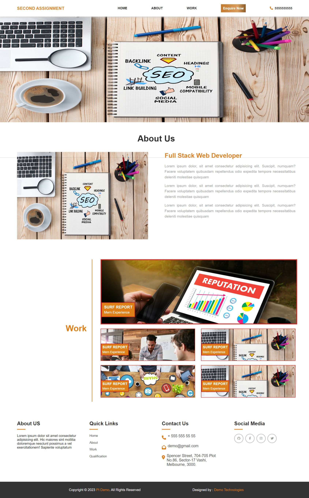
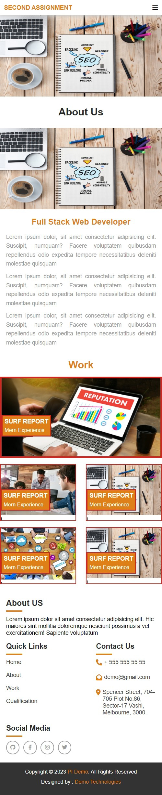
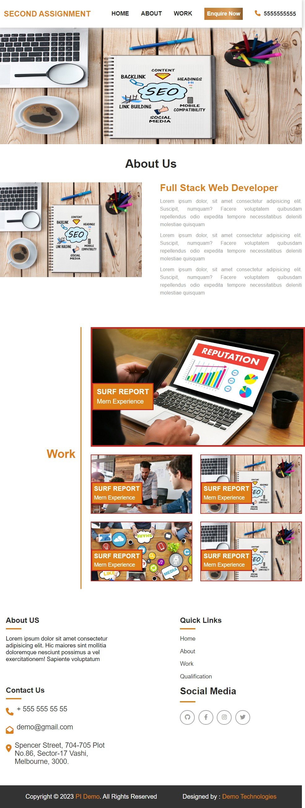

# Second-Assignment

#* **User Story**:-i had completed website which is based on HTML and Css. I have used HTML5 like header,Footer,nave ,section and etc.This website is based on responsive.I ahd done mobile reponsive menu which is done with javascript

* **Acceptance Criteria**::In this assignment , I had used everything which you nmention for making this assignment
1. I used sementic elements like header, nav, footer, figure, section etc
2. when we hover on image,it looks biiger than normal image 
3. I used link in nav bar to go every section.
4. it is mobile responsive.
5. I used 'hover' in navbar
6. I used the 'title' for most of every section to clear the section which category it belongs
7. I used 'positon' for header to create sticky.

  
   
    